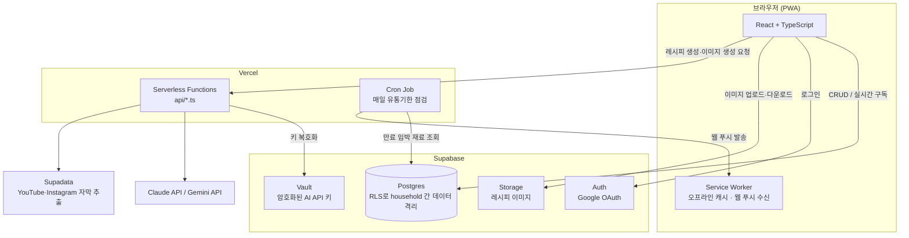

# 🍳 CookKit

밀가루·마늘 알러지가 있는 가족과 함께 요리할 일이 많아서 시작한 개인 프로젝트입니다.
Claude와 대화하며 알러지 없는 레시피를 짜고 인분·장보기 리스트를 정리하던 습관이
"아예 앱으로 만들자"로 이어졌고, 이후 [Claude Code](https://claude.com/claude-code)와
페어 프로그래밍하며 40여 차례에 걸쳐 기능을 반복적으로 확장해온 사이드 프로젝트입니다.

household(가구) 단위로 냉장고 재료·레시피·장보기 리스트를 함께 관리하고, 대화형 AI로
레시피를 만들거나 유튜브/인스타그램 링크를 레시피로 변환하고, 핸즈프리 음성 안내로
요리하는 것까지 지원하는 PWA입니다.

## ✨ 핵심 기능

- **AI 레시피 생성/수정** — Claude·Gemini 중 선택해 대화형으로 레시피를 만들고 다듬음.
  제안은 diff(변경사항 요약)로 먼저 보여주고 사용자가 확정해야 반영됨(자동 적용 없음)
- **유튜브·인스타그램 링크 → 레시피 변환** — 영상 자막을 추출해 재료/조리순서로 구조화
- **재료(냉장고) 관리** — 보유 여부·유통기한 추적, 영수증 촬영으로 일괄 등록, 알러지
  유발 성분 태깅 → 레시피 필터/대화형 AI에 자동 반영
- **인분 조절** — 레시피 상세에서 인분을 바꾸면 재료 수량이 비례해서 재계산
- **장보기 리스트** — 담은 레시피들의 재료를 자동 집계, 매장 카테고리별로 그룹핑
- **요리 모드** — 전체화면 단계별 안내 + 음성 명령(핸즈프리), 타이머, 여러 레시피
  동시 진행(복합 요리)
- **다른 가구 레시피 둘러보기** — 공개 레시피 탐색/복사, 좋아요·댓글, 닉네임으로 사용자 검색
- **PWA** — 홈 화면 설치, 오프라인 지원, 유통기한 임박 웹 푸시 알림(Vercel Cron)

## 🏗 아키텍처



**설계에서 눈여겨볼 부분**

- **household 기반 멀티테넌시** — 모든 테이블이 RLS(Row Level Security)로 격리되어,
  같은 가구 구성원끼리만 재료/레시피를 공유하고 공개(`visibility='public'`) 레시피만
  다른 가구에 노출됩니다. 애플리케이션 코드가 아니라 DB 정책이 접근 제어의 최종 방어선입니다.
- **AI 키는 브라우저에 존재하지 않음** — 사용자가 입력한 Anthropic/Gemini API 키는
  Supabase Vault에 암호화 저장되고, 실제 AI 호출은 항상 인증된 세션을 거쳐 서버(Vercel
  Functions)가 대신 수행합니다.
- **Claude/Gemini 듀얼 프로바이더** — 한쪽 무료 쿼터가 소진되거나 특정 기능(이미지 생성은
  Gemini 전용 등)이 필요할 때 설정에서 바로 전환할 수 있습니다.
- **오프라인 우선 UI 패턴** — 4개 탭을 항상 마운트해두고 `hidden`으로만 전환해 tab 전환 시
  상태가 유실되지 않으며, 서비스워커가 정적 자산을 미리 캐싱해 오프라인에서도 셸이 뜹니다.

## 🛠 기술 스택

| 영역 | 기술 |
|---|---|
| 프론트엔드 | React 19, TypeScript, Vite, PWA(`vite-plugin-pwa` + Workbox) |
| 백엔드 | Vercel Serverless Functions, Vercel Cron |
| 데이터베이스 | Supabase (PostgreSQL, Row Level Security) |
| 인증 | Supabase Auth (Google OAuth) |
| 스토리지 | Supabase Storage (레시피 이미지) |
| 시크릿 관리 | Supabase Vault (사용자별 AI API 키 암호화 저장) |
| AI | Anthropic Claude API, Google Gemini API (텍스트+이미지 생성, 사용자 선택형) |
| 외부 연동 | Supadata(유튜브/인스타그램 자막 추출), web-push(VAPID) |
| 기타 라이브러리 | `@dnd-kit`(순서 재정렬), `lucide-react`(아이콘) |
| 코드 품질 | oxlint |

## 📁 프로젝트 구조

```
├── api/                  # Vercel Serverless Functions (AI 프록시, 자막 추출, 크론 등)
│   └── _lib/              # 인증 검증, Supabase 서비스 롤 클라이언트 등 서버 전용 공용 코드
├── src/
│   ├── features/          # 화면 단위 컴포넌트 (auth/home/recipes/ingredients/shopping-list/settings)
│   ├── data/               # Supabase 접근 + 전역 상태(useSyncExternalStore 기반 store)
│   └── lib/                 # AI 프롬프트, 도메인 로직 등 순수 함수 유틸
├── supabase/
│   ├── schema.sql          # 신규 프로젝트용 기본 스키마 전체
│   └── migrations/         # schema.sql 이후 순서대로 적용하는 증분 마이그레이션
├── scripts/               # 공공데이터 시딩, 이미지 재압축 등 1회성 운영 스크립트
└── docs/architecture.md   # 주제별 아키텍처 결정 노트(왜 이렇게 만들었는지, 버그 원인 등)
```

## 🚀 실행 방법

### 준비물

- Node.js 20 이상
- [Supabase](https://supabase.com) 프로젝트 (무료 티어로 충분)
- (선택) [Vercel](https://vercel.com) 계정 — API 라우트까지 로컬에서 돌려보려면 필요

### 1. 클론 & 설치

```bash
git clone https://github.com/<your-username>/CookKit.git
cd CookKit
npm install
```

### 2. Supabase 데이터베이스 설정

Supabase 대시보드의 SQL Editor에서 순서대로 실행합니다.

1. `supabase/schema.sql` 전체 붙여넣고 실행 (기본 테이블/RLS 정책/RPC 생성)
2. `supabase/migrations/` 폴더의 파일을 **파일명 번호 순서대로**(0002 → 0039) 실행

### 3. 환경변수 설정

프로젝트 루트에 `.env.local`을 만들고 아래 값을 채웁니다(`vercel env pull .env.local`로
Vercel 프로젝트에 등록해둔 값을 한 번에 받아올 수도 있습니다).

| 변수 | 필수 | 설명 |
|---|---|---|
| `VITE_SUPABASE_URL` | ✅ | Supabase 프로젝트 URL |
| `VITE_SUPABASE_ANON_KEY` | ✅ | Supabase anon(public) 키 |
| `SUPABASE_URL` | ✅ | 서버(API 라우트)용 — `VITE_SUPABASE_URL`과 동일 값 |
| `SUPABASE_SERVICE_ROLE_KEY` | ✅ | 서버 전용 — Vault 접근 등 RLS를 우회하는 관리자 작업에 사용 |
| `VITE_VAPID_PUBLIC_KEY` / `VAPID_PRIVATE_KEY` | 선택 | 웹 푸시 알림(유통기한 임박 알림)에 필요 |
| `CRON_SECRET` | 선택 | 유통기한 점검 Cron 엔드포인트 인증용 |
| `SUPADATA_API_KEY` | 선택 | 자막이 없는 유튜브 영상/인스타그램 자막 추출 폴백 |

> AI(Anthropic/Gemini) API 키는 환경변수가 아니라 **앱 실행 후 설정 화면에서 직접 입력**합니다
> (Supabase Vault에 암호화 저장되는 방식이라 `.env`에는 두지 않습니다).

### 4. 실행

```bash
npm run dev        # 프론트엔드만 (localhost:5173) — API 라우트는 동작하지 않음
npm run dev:full    # vercel dev — 프론트엔드 + api/ 라우트 전부 (localhost:3000)
```

### 5. 빌드

```bash
npm run build
npm run lint
```

## 📄 더 읽을거리

- [`docs/architecture.md`](docs/architecture.md) — 주제별 아키텍처 결정과 그 배경(왜 이렇게
  만들었는지, 겪었던 버그와 원인 등)을 담은 상세 노트
- [`CLAUDE.md`](CLAUDE.md) — 이 프로젝트를 AI 페어 프로그래밍으로 개발해온 전체 이력
